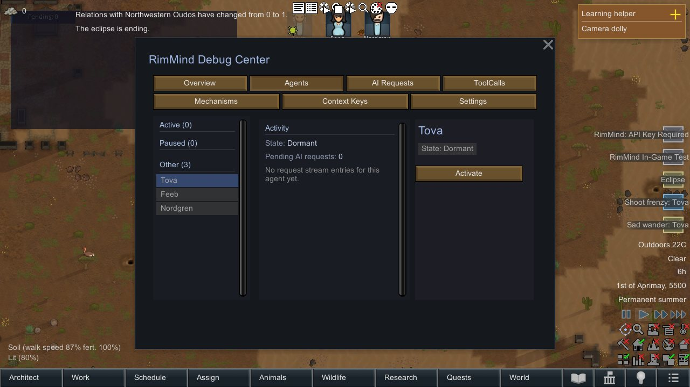
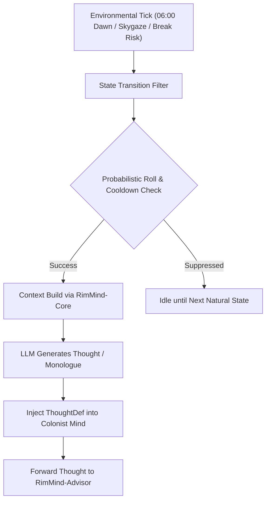

<div align="center">

# RimMind-Personality 🎭
### Big-Five Psychological Profiles & Probabilistic State-Transition Reflection for RimWorld 1.6

**English** | [简体中文](README_zh.md)

<p>
  <a href="https://rimworldgame.com/"></a>
  <a href="https://github.com/mcocdaa/RimWorld-RimMind-Mod-Core"></a>
  <a href="#"></a>
  <a href="LICENSE"></a>
</p>

<p><em>Infuse colonists with multidimensional psychological depth, dawn soliloquies, and organic mood reflections.</em></p>

</div>

---

## 📖 Overview

**RimMind-Personality** models colonists with nuanced Big-Five personality dimensions (Openness, Conscientiousness, Extraversion, Agreeableness, Neuroticism). Instead of rigid timer loops, personality reflections occur dynamically through **probabilistic state transitions**.

### Key Highlights
- **Big-Five Cognitive Profiling**: Maps vanilla RimWorld traits (e.g., Bloodlust, Slothful, Optimist) onto continuous psychometric axes, guiding tone and decision rationale.
- **Probabilistic State-Transition Engine**: Colonists reflect on life during meaningful environmental moments:
  - 🌅 **Sunrise (06:00 Dawn)**: Morning reflection as daylight returns (chance: 30%).
  - 🌌 **Skygazing / Solitude**: Philosophical or poetic musings (chance: 40%).
  - 🍷 **Shared Recreation**: Social warmth or witty cynicism (chance: 25%).
  - 💔 **Traumatic Mood Swings**: Severe mental break risks trigger desperate internal rationales (chance: 50%).
- **Thought Injection**: AI-generated psychological reflections manifest directly as RimWorld `ThoughtDef` entries, influencing mood and mental break thresholds.

---

## 🎮 In-Game Showcase


*Dawn soliloquy in action: A colonist standing in the morning light triggers an introspective thought bubble reflecting their Big-Five traits.*

---

## 🏛️ Architecture & State-Transition Pipeline



---

## 🛠️ Installation & Load Order

```text
1. Harmony
2. Core (Vanilla RimWorld)
3. RimMind-Core
4. RimMind-Personality
```

---

## 🧪 Developer Guide & Testing

Run unit tests directly:

```powershell
dotnet test RimMind-Personality/Tests/RimMindPersonality.Tests.csproj -c Release
```

---

## 📜 License

Licensed under the [MIT License](LICENSE).
