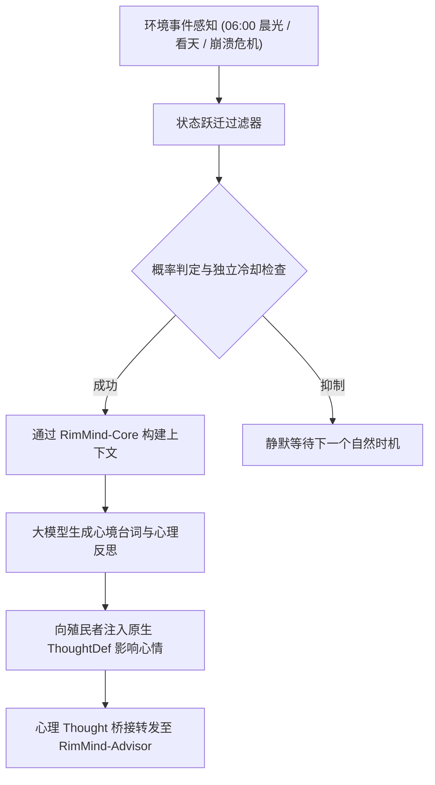

<div align="center">

# RimMind-Personality 🎭
### 专为 RimWorld 1.6 打造的大五人格特质画像、概率状态跃迁与心境反思系统

[English](README.md) | **简体中文**

<p>
  <a href="https://rimworldgame.com/"></a>
  <a href="https://github.com/mcocdaa/RimWorld-RimMind-Mod-Core"></a>
  <a href="#"></a>
  <a href="LICENSE"></a>
</p>

<p><em>为殖民者注入多维心理深度、晨曦哲学独白与自然随境而生的心境波动。</em></p>

</div>

---

## 📖 模块概览

**RimMind-Personality** 通过大五人格心理学模型（开放性、尽责性、外向性、宜人性、神经质）对殖民者进行立体刻画。它彻底摒弃死板机械的定时器轮询，通过**基于概率的状态跃迁触发体系**让小人在富有意义的环境情境下自然反思。

### 核心特性
- **立体大五人格画像**：将原版特质（嗜血、懒惰、乐天派等）映射为平滑的心理测量维度，决定其心理潜台词与行动逻辑。
- **概率状态跃迁引擎**：在自然情境发生时机投骰感知：
  - 🌅 **破晓晨曦 (06:00)**：清晨微光洒下时的内心独白（概率 30%）。
  - 🌌 **仰望星空 / 独处**：户外看天或漫步时的哲学与诗意遐思（概率 40%）。
  - 🍷 **娱乐聚会**：与同伴共处时的风趣幽默或冷峻审视（概率 25%）。
  - 💔 **心态剧变**：面临严重精神崩溃边缘时的绝望反思或心理自救（概率 50%）。
- **心理 Thought 注入**：AI 生成的心理反思直接转化为 RimWorld 的原生 `ThoughtDef`，实质影响小人的心情与精神崩溃阈值。

---

## 🎮 实机特性展示


*晨曦心境独白实机：清晨时分，殖民者在阳光下自发产生反映其大五人格特质的心境独白与气泡。*

---

## 🏛️ 系统架构与状态跃迁管道



---

## 🛠️ 安装与加载顺序

```text
1. Harmony
2. Core (RimWorld 原版)
3. RimMind-Core
4. RimMind-Personality
```

---

## 🧪 开发者测试指南

运行单元测试：

```powershell
dotnet test RimMind-Personality/Tests/RimMindPersonality.Tests.csproj -c Release
```

---

## 📜 开源协议

本项目采用 [MIT License](LICENSE) 开源许可证。
